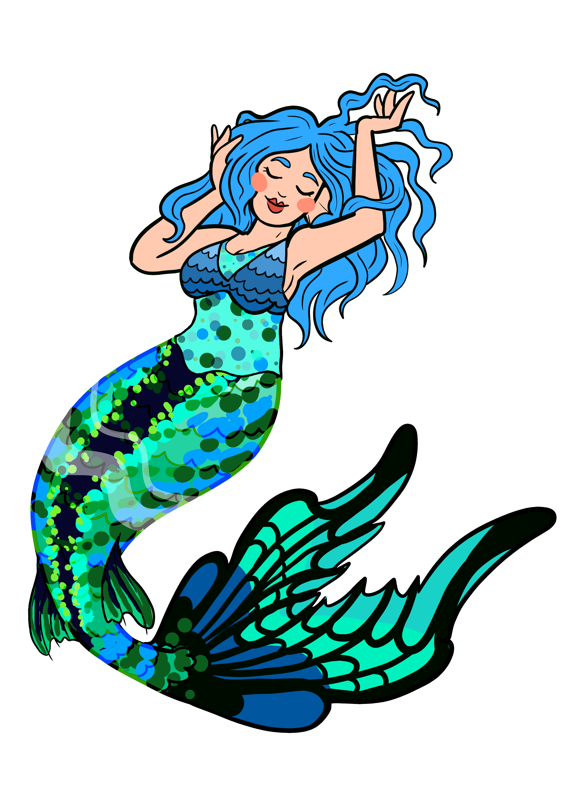

# Warning: Pages are constantly being updated during course 5th June till 11th August 2023. If you see any mistakes or can offer suggestions to improve please let me know.

# Table of Contents

1. [Introduction](#introduction)
2. [About](#about)
4. [102](/102/102Course.md)
5. [201](/201/201Course.md)
6. [301](/01/301Course.md)
7. [Useful Information](useful-information)

# Introduction

***Hello*** my name is Jessica! Feel free to call me Jess/Jessica I do not mind which and my pronouns are she/her.
I have over 10 years of Quality/Testing experience working with embedded devices as well as web so learning how to create code from 'the other side' is very exciting!
I am dyslixic so please let me know if there are any spelling mistakes on here and I will attempt to correct them!!!!

When I am not at work you will find me:
- With my Son (he is currently 2), Husband (SW Engineer so useful to have around during this course) and Cat (not so useful to have on the course)
- Playing Video Games and/or Boardgames (Currently Zelda Tears of the Kingdom)
- Sewing! I have currently gotten into bag making

- Wild swimming! Anywhere I can swim with my tail

Github: [QualityMermaid](https://github.com/QualityMermaid)  
Twitter: [@OpheraBane](https://twitter.com/OpheraBane)  
LinkedIn: [JessicaBane](https://www.linkedin.com/in/jessica-bane-testing-mermaid/)

# About

This page is for my notes during Tech Course 5th June 2023.
Link to live page [HERE](https://qualitymermaid.github.io/TechEducationClone/)

## Final thoughts

***Just keep swimming. You will get there!***

